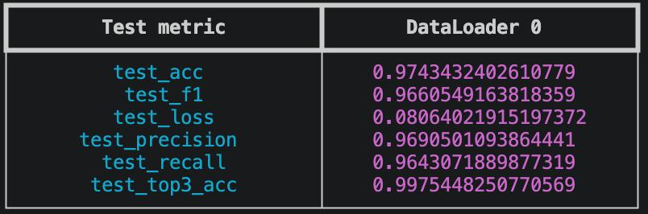
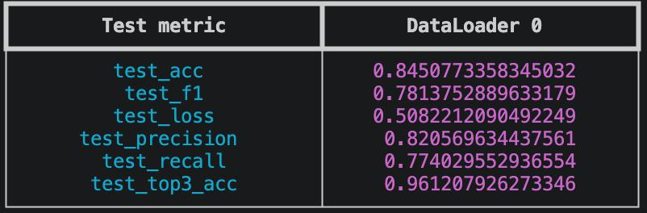

# Leaf Classifier

Классификация болезней растений по фотографии листа с использованием CNN.

---

## Содержание

- [Постановка задачи](#постановка-задачи)
- [Формат данных](#формат-данных)
- [Метрики](#метрики)
- [Датасет](#датасет)
- [Моделирование](#моделирование)
- [Внедрение](#внедрение)
- [Setup](#setup)
- [Train](#train)
- [Production Preparation](#production-preparation)
- [Infer](#infer)
- [Структура проекта](#структура-проекта)

---

## Постановка задачи

Задача — обучить CNN, способную по фотографии листа растения определить, здорово ли оно, и классифицировать конкретную болезнь. Представляет собой **многоклассовую классификацию изображений** (38 классов).

Практическое применение: сервис диагностики болезней растений для агрономов и фермеров, позволяющий получить диагноз по загруженной фотографии листа.

## Формат данных

**Вход:** изображение листа растения в формате JPEG или PNG, минимальный размер 32×32 пикселя.

**Выход:** JSON-объект с предсказанием диагноза и вероятностью предсказания:

```json
{
  "top1": { "class": "Tomato__Late_blight", "probability": 0.92 },
  "top3": [
    { "class": "Tomato__Late_blight", "probability": 0.92 },
    { "class": "Tomato__Early_blight", "probability": 0.05 },
    { "class": "Tomato_healthy", "probability": 0.02 }
  ]
}
```

Поле `class` содержит название вида растения и диагноз в формате `Plant__Disease` (или `Plant_healthy`). Поле `probability` — уверенность модели в предсказании.

## Метрики

Используем следующие метрики для многоклассовой классификации (все вычисляются на тестовой выборке):

| Метрика               | Описание                                                      | Целевое значение |
| --------------------- | ------------------------------------------------------------- | ---------------- |
| **Accuracy**          | Доля правильно классифицированных изображений                 | > 0.85           |
| **F1-score (macro)**  | Среднее гармоническое precision и recall по классам           | > 0.83           |
| **Precision (macro)** | Средняя точность по классам                                   | > 0.83           |
| **Recall (macro)**    | Средняя полнота по классам                                    | > 0.83           |
| **Top-3 Accuracy**    | Доля изображений, для которых правильный класс входит в топ-3 | > 0.97           |

**Обоснование целевых значений:** На датасете PlantVillage лучшие вариации CNN могут получить до 90-95% accuracy. Для нашей задачи, конфигурации и ресурсов будем ориентироваться на границу значения метрик >0.85, как на консервативную оценку с запасом.

## Датасет

**PlantVillage Dataset** — датасет,созданный для автоматической диагностики заболеваний сельскохозяйственных культур, состоящий из изображений зараженных различными видами заболеваний растений.

- **Объём:** 54,306 изображений
- **Классы:** 38 (14 видов растений, несколько болезней на каждый вид + здоровые)
- **Растения:** 14 видов (томат, картофель, перец, яблоня, виноград и т.д.)
- **Разрешение:** 256×256 пикселей, формат JPEG
- **Ссылка на Kaggle:** [abdallahalidev/plantvillage-dataset](https://www.kaggle.com/datasets/abdallahalidev/plantvillage-dataset)

**Особенности и сложности:**

- **Дисбаланс классов:** от ~200 изображений (минимум) до ~5,000 (максимум) на класс
- **Контролируемые условия съёмки:** однородный серый или зелёный фон, что упрощает задачу по сравнению с полевыми условиями
- **Визуально похожие симптомы:** некоторые болезни имеют довольно схожий внешний вид
- **Разбиение датасета:** train/val/test = 70%/15%/15% со стратификацией по классам, random seed = 42

## Моделирование

### Бейзлайн

Простая 3-блочнаяая CNN (~0.3M параметров):

```
Block 1: Conv2d(3→32, 3×3) → BatchNorm → ReLU → MaxPool2d(2)
Block 2: Conv2d(32→64, 3×3) → BatchNorm → ReLU → MaxPool2d(2)
Block 3: Conv2d(64→128, 3×3) → BatchNorm → ReLU → MaxPool2d(2)
GlobalAvgPool → Flatten → Linear(128→64) → ReLU → Dropout(0.3) → Linear(64→38)
```

**Предобработка:** Resize(256×256) → ToTensor → Normalize(ImageNet stats)
**Постобработка:** softmax → argmax → декодирование имени класса через `class_names.json`

### Основная модель

5-блочная CNN с механизмом **Squeeze-and-Excitation (SE)** внимания после каждого сверточного блока (~4.1M параметров).

```
Block i: Conv2d → BatchNorm → ReLU → SEBlock → MaxPool2d(2)
Число фильтров: 64 → 128 → 256 → 512 → 512

SEBlock: AdaptiveAvgPool → Flatten → Linear(C→C/16) → ReLU → Linear(C/16→C) → Sigmoid
         (масштабирует каждый канал по важности)

GlobalAvgPool → Flatten → Linear(512→256) → ReLU → Dropout(0.5) → Linear(256→38)
```

**Preprocess (for training):**

- Resize(256×256)
- RandomHorizontalFlip, RandomVerticalFlip
- RandomRotation(30°)
- ColorJitter(brightness=0.1, contrast=0.1, saturation=0.1, hue=0.1)
- ToTensor + Normalize(mean=[0.485, 0.456, 0.406], std=[0.229, 0.224, 0.225])

**Preprocess (for inference):** Resize(256×256) → ToTensor → Normalize

**Postprocess:** logits → softmax → top-k индексов → декодирование через `class_names.json` → JSON-ответ с вероятностями

**Фреймворк:** [PyTorch Lightning](https://lightning.ai/docs/pytorch/stable/) с колбэками EarlyStopping и ModelCheckpoint
**Логирование:** [MLflow](https://mlflow.org/) — метрики, гиперпараметры, git commit hash

## Внедрение

**Пайплайн инференса:**

1. Загрузка изображения
2. Предобработка (resize до 256×256 + normalization)
3. Forward pass через ONNX Runtime (CPU) или Triton Inference Server + prediction
4.  Декодирование top-3 индексов в имена классов
5. Возврат ответа в формате JSON с `top1` и `top3` предсказаниями

**Форматы модели:**

- PyTorch checkpoint (`.ckpt`) — для дообучения
- ONNX (`.onnx`) — для оптимизированного инференса через ONNX Runtime или Triton

---

## Setup

### Требования

- Python 3.10+
- [uv](https://docs.astral.sh/uv/)
- (Опционально) NVIDIA GPU с CUDA / Apple Silicon MPS (для обучения)

### Установка

1. Устанавливаем uv

```bash
curl -LsSf https://astral.sh/uv/install.sh | sh
source $HOME/.local/bin/env
```

2. Клонируем репозиторий

```bash
git clone https://github.com/<your-username>/leaf-classifier
cd leaf-classifier
```

3. Создаем виртуальное окружение и устанавливаем зависимости + активируем окружение

```bash
uv sync
source .venv/bin/activate
```

4. Установка и проверка pre-commit хуков

```bash
uv run pre-commit install
uv run pre-commit run -a
```

### Загрузка данных

Вариант 1: через DVC

```bash
uv run dvc pull
git status
```

Вариант 2: прямая загрузка из Kaggle с помощью Kaggle API (по умлочанию датасет сохранится в директорию `data/plantvillage/`)

```bash
uv run pip install kaggle
uv run python scripts/download_data.py
```

---

## Train

# Запуск обучения основной модели (CNN + SE-blocks)

```bash
uv run python commands.py train
```

# Запуск обучения бейзлайна (простая 3-блочная vanilla CNN)

```bash
uv run python commands.py train model=baseline
```

# Запуск с переопределением параметров, заданных в конфиге

```bash
uv run python commands.py train training.epochs=50 training.batch_size=128 training.learning_rate=0.0005
```

# Запуск MLflow UI для просмотра метрик (в отдельном терминале)

```bash
uv run mlflow ui --port 8080
```

После обучения в папке `plots/` появятся графики:

- `{name}_training_loss.png` — кривые потерь (train/val)
- `{name}_validation_accuracy.png` — точность на валидации
- `{name}_validation_metrics.png` — F1, Precision, Recall на валидации

Также в конце цикла обучения модели в формате ONNX и файл class_names.json сохраняются в директорию `artifacts/`.
Checkpoint лучшей модели в формате ckpt — в директорию`checkpoints/`. в формате `{name}-epoch={epoch}-val_loss={val_loss}.ckpt`.






---

## Production Preparation

### ONNX

ONNX экспорт выполняется автоматически в конце обучения. Для ручного экспорта:

```bash
uv run python scripts/convert_to_onnx.py checkpoints/cnn-epoch=XX-val_loss=X.XXXX.ckpt
```

---

## Infer

### Локальный инференс (ONNX Runtime)

Через commands.py

```bash
uv run python commands.py infer /path/to/image.jpg
```

Через infer.py (публичный API)

```bash
uv run python infer.py /path/to/image.jpg
```

Пример вывода:

```text
{
"top1": {"class": "Tomato__Late_blight", "probability": 0.9234},
  "top3": [
    {"class": "Tomato__Late_blight", "probability": 0.9234},
    {"class": "Tomato__Early_blight", "probability": 0.0511},
    {"class": "Tomato_healthy", "probability": 0.0187}
  ]
}
```

**Формат входных данных:** JPEG или PNG изображение листа растения, минимум 32×32 пикселя.

### Triton Inference Server

Модели хранятся в `triton_models/` (ONNX-файлы в версионированных подпапках, конфиги отслеживаются git).

#### Запуск

0. (Extra) Скачиваем docker-image

```bash
docker pull --platform linux/amd64 nvcr.io/nvidia/tritonserver:24.05-py3
```

1. Устанавливаем tritonclient

```bash
uv sync --extra triton
```

2. Запускаем Triton через Docker Compose

```bash
docker compose up -d
```

3. Дожидаемся готовности сервера (~30 с)

```bash
curl -s http://localhost:8000/v2/health/ready
```

4. Запустить тест

```bash
# baseline
uv run python scripts/triton_test.py /path/to/leaf.jpg
# CNN

uv run python scripts/triton_test.py /path/to/leaf.jpg \
  --model_name leaf_classifier_cnn
```

Если хотим вывести top_k наиболее вероятных диагнозов:

```bash
uv run python scripts/triton_test.py /path/to/leaf.jpg \
  --server_url localhost:8000 \
  --model_name leaf_classifier_baseline \
  --top_k 5
```

6. Остановка сервера

```bash
docker compose down
```

---

## Структура проекта

```
leaf-classifier/
├── leaf_classifier/
│   ├── data/
│   │   ├── dataset.py         # PlantDiseaseDataset
│   │   └── datamodule.py      # Lightning DataModule
│   ├── models/
│   │   ├── baseline.py        # Baseline vanilla CNN
│   │   └── cnn.py             # Основная модель CNN+SE
│   ├── training/
│   │   ├── module.py          # LightningModule
│   │   └── trainer.py         # Training cycle
│   ├── inference/
│   │   └── predictor.py       # ONNX Runtime инференс → JSON ответ
│   └── utils/
│       ├── export.py          # Экспорт модели в ONNX
│       └── plots.py           # Callback для сохранения графиков обучения
│
├── configs/                   # Hydra конфигурации
│   ├── config.yaml            # Главный конфиг с defaults list
│   ├── data/default.yaml      # Параметры данных и аугментаций
│   ├── model/
│   │   ├── cnn.yaml           # Конфиг основной модели CNN+SE
│   │   └── baseline.yaml      # Конфиг baseline vanilla CNN
│   ├── training/default.yaml  # Гиперпараметры обучения
│   └── logging/mlflow.yaml    # MLflow tracking URI и experiment name
│
├── scripts/
│   ├── download_data.py       # Загрузка PlantVillage из Kaggle
│   ├── convert_to_onnx.py     # Конвертация checkpoint → ONNX
│   └── triton_test.py         # Тест Triton Inference Server
│
├── triton_models/
│   ├── leaf_classifier_baseline/
│   │   ├── config.pbtxt       # ONNX Runtime, CPU, dynamic batch
│   │   └── 1/model.onnx       # Baseline
│   └── leaf_classifier_cnn/
│       ├── config.pbtxt       # ONNX Runtime, CPU, dynamic batch
│       └── 1/model.onnx       # SE-CNN
│
├── dvc/                       # DVC
│   ├── data.dvc               # → data/ (remote: data-storage)
│   ├── checkpoints.dvc        # → checkpoints/ (remote: model-storage), cpkt format
│   └── artifacts.dvc          # → artifacts/ (remote: model-storage), onnx format
│
├── plots/                     # Графики обучения
│
├── .dvc/config                # DVC конфиг
├── docker-compose.yml         # Triton Inference Server
├── commands.py                # CLI
├── infer.py                   # Публичный API инференса
├── pyproject.toml             # Зависимости
├── .pre-commit-config.yaml    # pre-commit-hooks
├── .gitignore
└── README.md
```
